## Re Connect CDMX ##
##### Humberto Jaimes - humberto@humbertojaimes.net #####
##### Saturnino Pimentel - @saturpimentel #####
# Creando y consumiendo Azure Functions #

A lo largo de este laboratorio crearemos un par de Azure Functions las cuales consumiremos desde una aplicación Xamarin.Forms

## Requerimientos ##

- Tener 1 cuenta Azure activa, puede ser una cuenta gratuita.
- Tener instaladas las herramientas de Xamarin.

## Creando y configurando los servicios en Azure ##

1. Crea un nuevo grupo de recursos en Azure llamado "Reconnect"

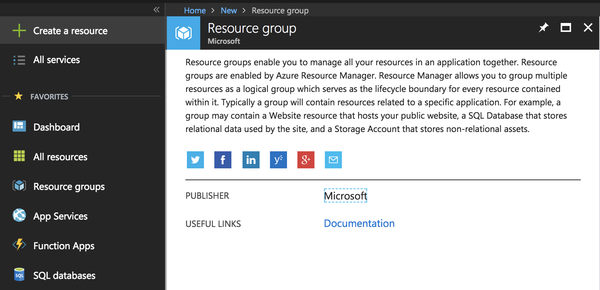

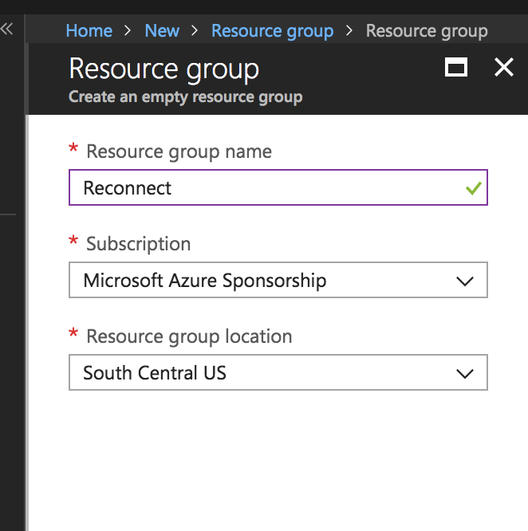

2. Crea un nuevo recurso de tipo "Function App" y agregalo al grupo de recursos creado anteriormente. El nombre del recursos puede ser algo como "reconnect(tus iniciales)func" y la cuenta de storage "reconnect(tus iniciales)sto"

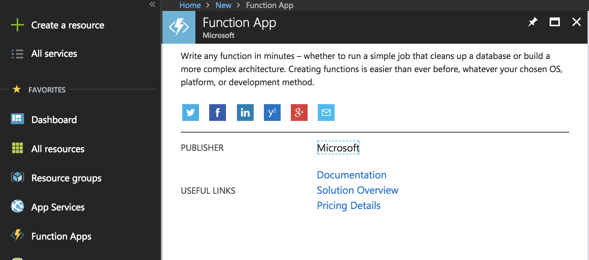

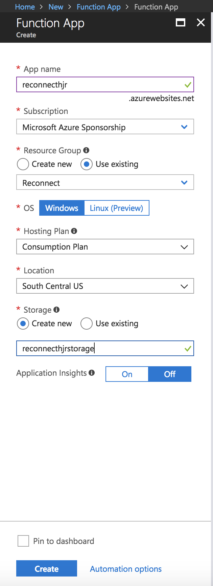

3. Crea un recurso de tipo "Computer Vision  API" y al igual que en el caso anterior agregalo al grupo de recursos Reconnect. Siguiendo la nomenclatura este puede llamarse "reconnect(tus iniciales)vis"

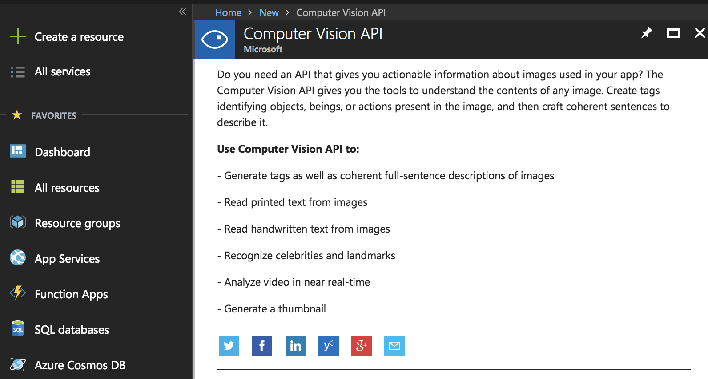

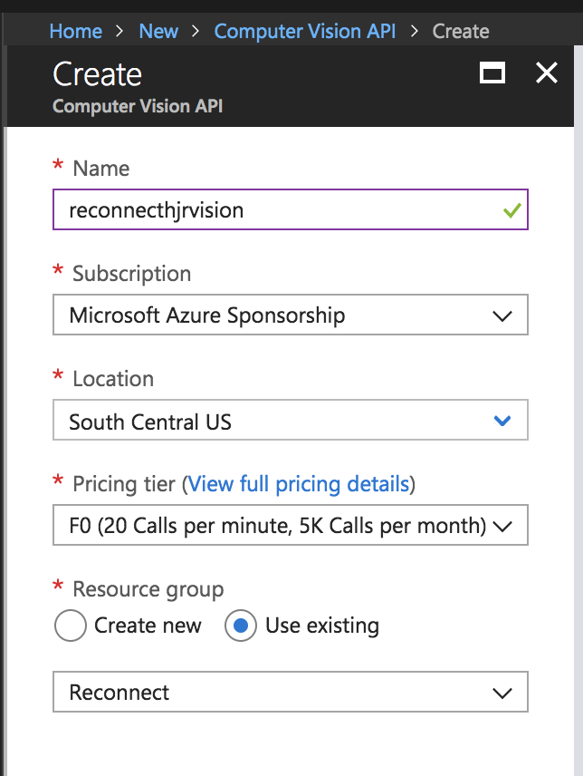

4. Ya con estos servicios generados debemos realizar unas configuraciones a cada uno.

4.1 Primero debes acceder al storage para crear un nuevo contenedor de blobs llamado "faces"

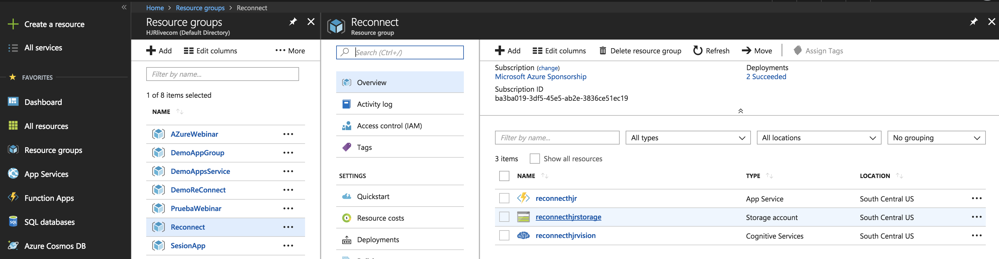

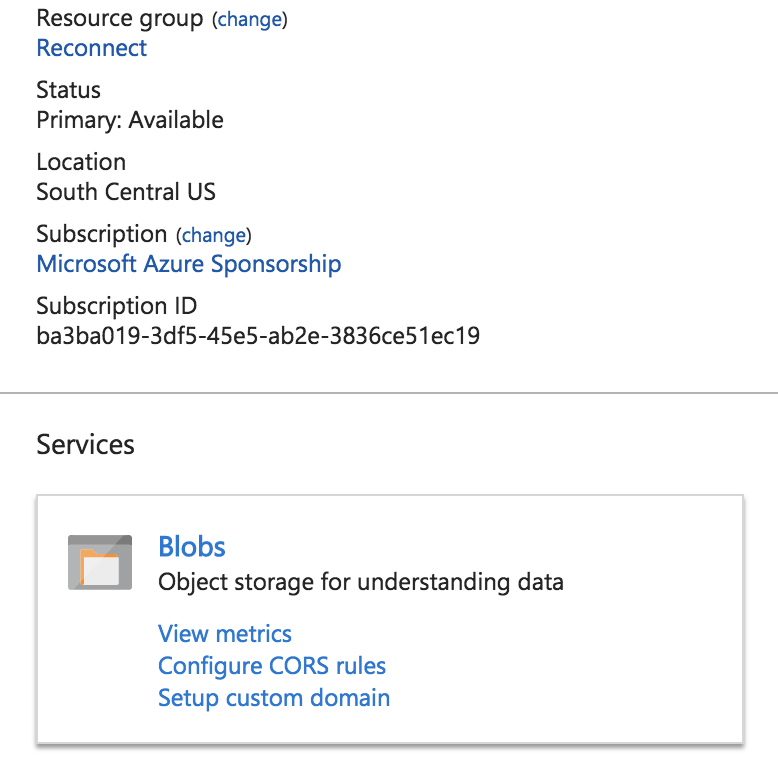

**Importante:** Darle permisos de contenedor, al nuevo que generemos.

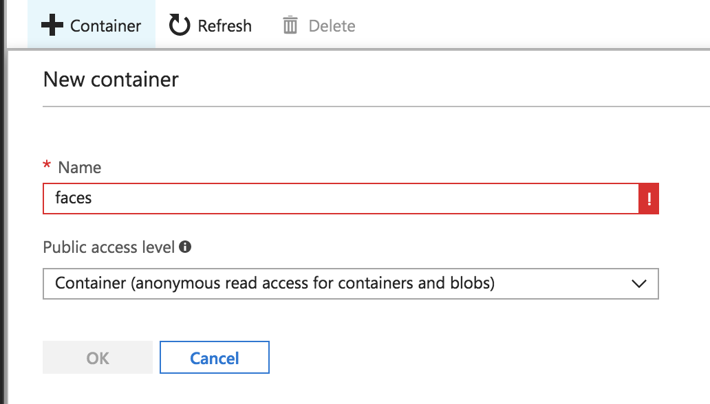

4.2 Ahora accede al recurso de Vision API y obtén la URL y llave con la que se puede consumir.

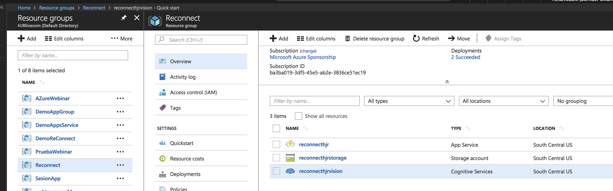

Selecciona "overview"
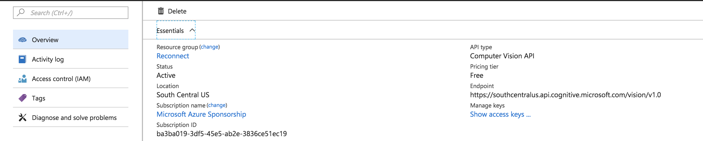

Copia la URL del servicio que muestra, tenla disponible para los siguientes pasos y accede a las "Access Keys"

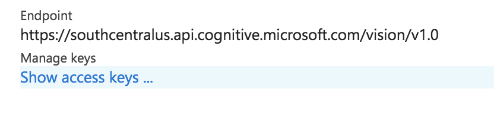

Copia cualquiera de las dos llaves, esta se usará en el siguiente paso

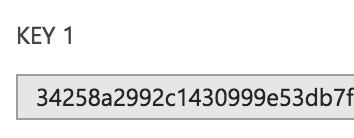

4.3 Ahora hay que acceder a la "Function App" para pasarle esa llave.

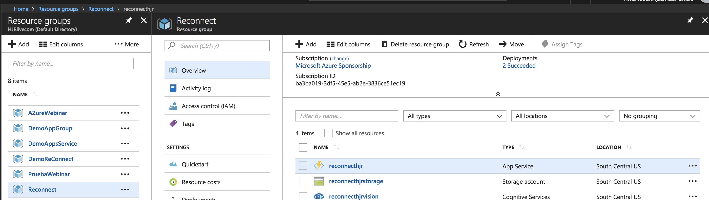

Selecciona la app creada para este ejercicio y accede a la parte de "application settings"

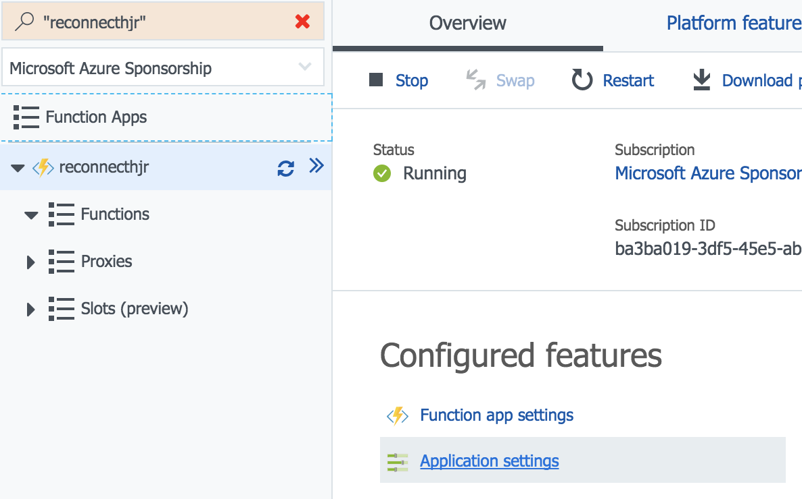

Agrega un nuevo setting llamado "Vision_API_Subscription_Key" y como valor pon la llave copiada del Api de Vision.

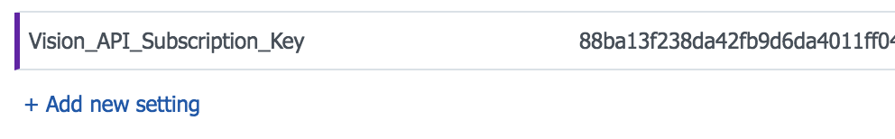

Guarda los cambios


Con esto tenemos listo todo lo necesario para comenzar a crear nuestras funciones.

## Creando las Azure Function ##

1. Crea una función presionando el "+" junto a tu app.

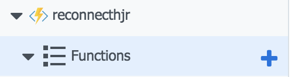

Selecciona la opción "Custom Function" en la siguiente ventana.

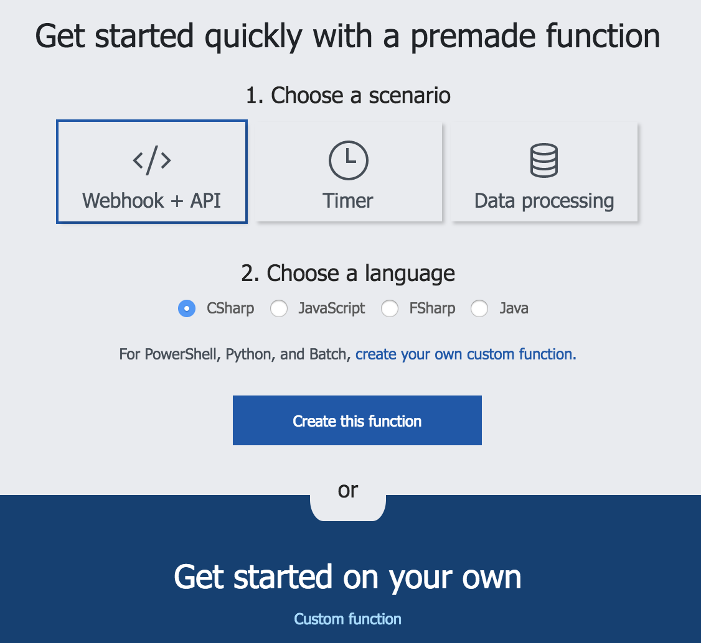

Utilizaremos una de tipo "Blob Trigger"

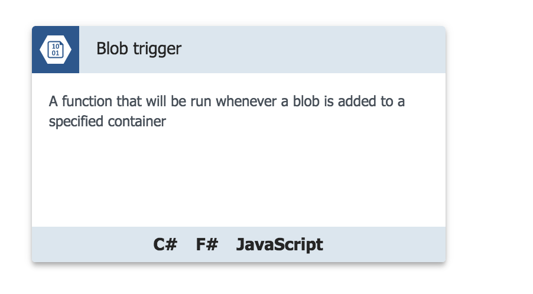

La función debe ser con C# como lenguaje, hay que definirle un nombre en este ejemplo se llama "AnalyzeFace".

Otro punto importante es definir la ruta dentro del storage que debe revisar, aquí debemos poner el nombre de nuestro contenedor y el tipo de archivo que esperamos.

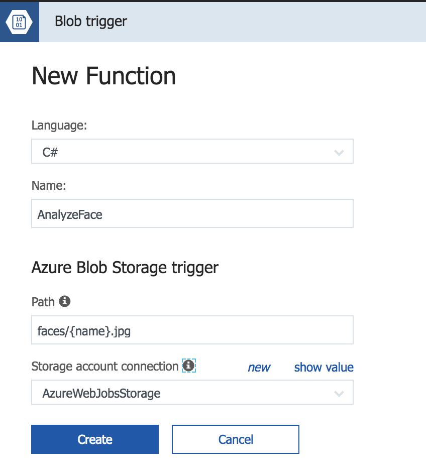

2. Para completar la configuración de la función debemos configurar las entradas y salidas de la función.

El ejemplo tomara un blob, lo analizará y guardara los resultados en una Table dentro del Storage de la función.

Esto se hace en la opción "Integrate" de la función.

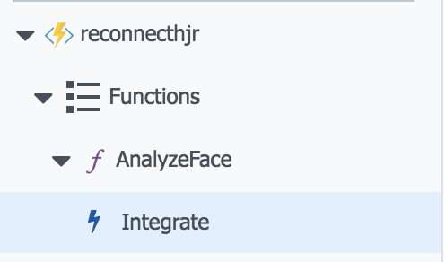

La configuración de "Triggers" debe estar de este modo

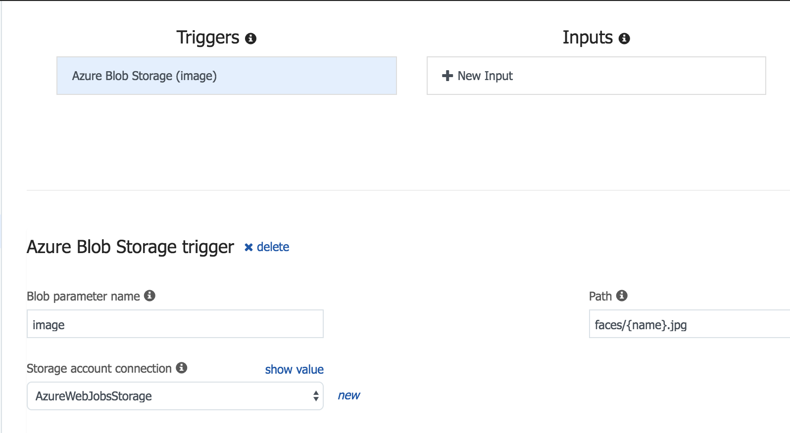

En "OutPuts" hay que agregar uno de tipo Table Storage con los siguiente parametros.

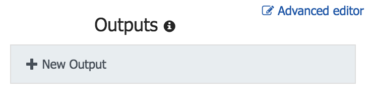

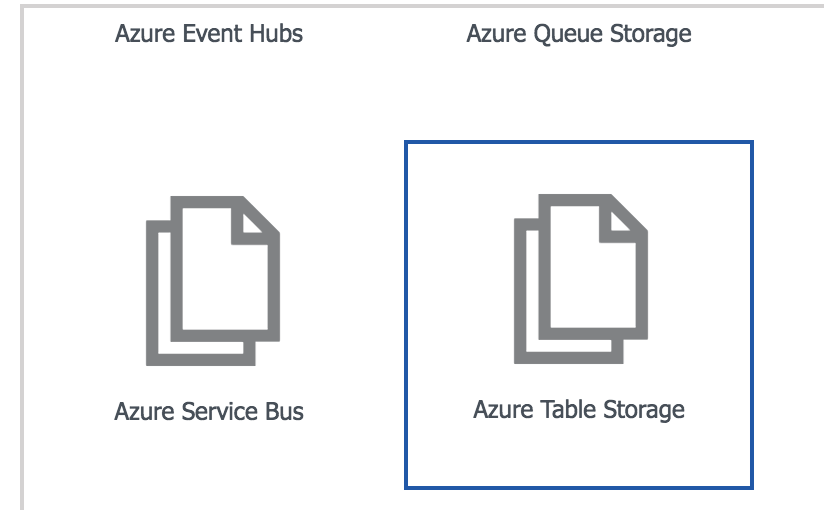

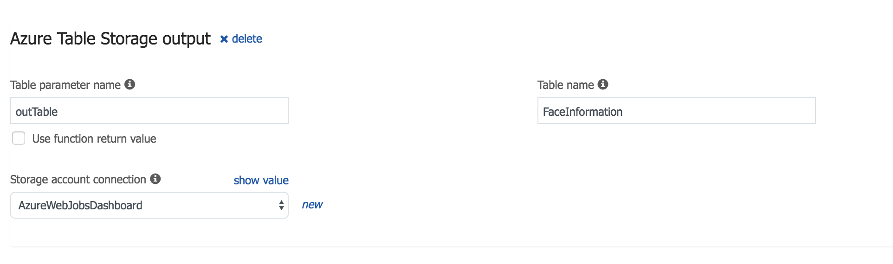

3. Este es el código que usaremos en la función, solo reemplaza la línea 41 con la url de tu API de Vision.

```
#r "Microsoft.WindowsAzure.Storage"
#r "Newtonsoft.Json"

using System.IO;
using System.Net;
using System.Net.Http;
using System.Net.Http.Headers;
using Newtonsoft.Json;
using Microsoft.WindowsAzure.Storage.Table;

public static async Task Run(Stream image, string name, IAsyncCollector<FaceRectangle> outTable, TraceWriter log)
{
    log.Info($"Inicio de la operación"); 
    string result = await CallVisionAPI(image,log);
    log.Info($"Resultado de la operación: {result}");

    if (String.IsNullOrEmpty(result))
    {
        return;
    }

    ImageData imageData = JsonConvert.DeserializeObject<ImageData>(result);
    log.Info($"imagenes:{imageData}");
    foreach (Face face in imageData.Faces)
    {
        var faceRectangle = face.FaceRectangle;
        faceRectangle.RowKey = Guid.NewGuid().ToString();
        faceRectangle.PartitionKey = "Reconnect";
        faceRectangle.ImageFile = name + ".jpg";
        faceRectangle.Age=face.Age;
        faceRectangle.Gender=face.Gender;
        await outTable.AddAsync(faceRectangle);
    }
}

static async Task<string> CallVisionAPI(Stream image,  TraceWriter log)
{
    using (var client = new HttpClient())
    {
        var content = new StreamContent(image);
        var url = "https://southcentralus.api.cognitive.microsoft.com/vision/v1.0/analyze?visualFeatures=Faces&language=en";
        client.DefaultRequestHeaders.Add("Ocp-Apim-Subscription-Key", Environment.GetEnvironmentVariable("Vision_API_Subscription_Key"));
        content.Headers.ContentType = new MediaTypeHeaderValue("application/octet-stream");
        var httpResponse = await client.PostAsync(url, content);

        log.Info($"Estatus code {httpResponse.StatusCode}");
        log.Info($"Content {await httpResponse.Content.ReadAsStringAsync()}");
        if (httpResponse.StatusCode == HttpStatusCode.OK)
        {
            return await httpResponse.Content.ReadAsStringAsync();
        }
        
    }
    return null;
}

public class ImageData
{
    public List<Face> Faces { get; set; }
}

public class Face
{
    public int Age { get; set; }

    public string Gender { get; set; }

    public FaceRectangle FaceRectangle { get; set; }
}

public class FaceRectangle : TableEntity
{
    public string ImageFile { get; set; }

    public int Left { get; set; }

    public int Top { get; set; }

    public int Width { get; set; }

    public int Height { get; set; }

    public int Age { get; set; }

    public string Gender { get; set; }
}

```

## Creando una segunda función para exponer los datos ##

1. Crea una nueva función en tu misma Function App, en este caso utilizando la plantilla "HttpGet"


Los datos de esta nueva función son los siguientes. 

*Nota: EL nombre de la tabla es sensible a mayúsculas y minúsculas.

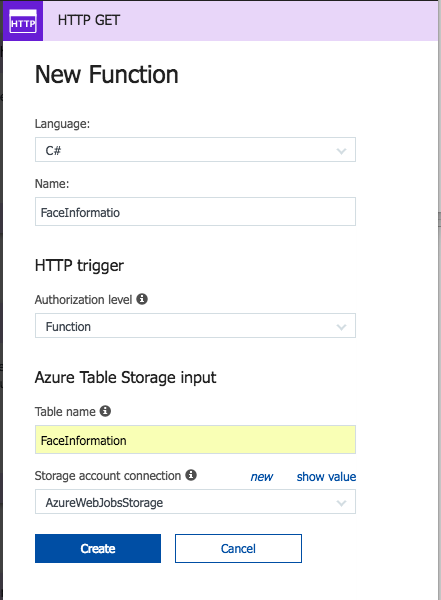

2. Dentro de la parte de "Integrate" solo modificaremos el "Route Template" este valor indica la ruta con la que podemos invocar a la función.

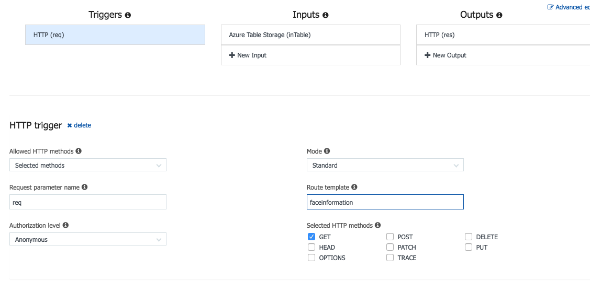

3. Finalmente el código de la función es el siguiente. Es muy parecido al de la plantilla solo modificando la definición de Person y el campo con el que imprime el Log.

```
#r "Microsoft.WindowsAzure.Storage"

using Microsoft.WindowsAzure.Storage.Table;
using System.Net;
using Microsoft.AspNetCore.Mvc;
using Microsoft.Extensions.Primitives;

public static IActionResult  Run(HttpRequestMessage req, CloudTable inTable, TraceWriter log)
{
    var querySegment = inTable.ExecuteQuerySegmentedAsync(new TableQuery<Person>(), null);
    foreach (Person person in querySegment.Result)
    {
        log.Info($"Name:{person.ImageFile}"); 
    }

   return (ActionResult)new OkObjectResult(querySegment.Result); 
}

public class Person : TableEntity
{
    public string ImageFile { get; set; }

    public int Left { get; set; }

    public int Top { get; set; }

    public int Width { get; set; }

    public int Height { get; set; }

    public int Age { get; set; }

    public string Gender { get; set; }
}
```

## Creando una app Xamarin que consuma las funciones ##

1. El primer paso es crear una app Xamarin.Forms en blanco. Puede ser con Net Standard o con PCL.

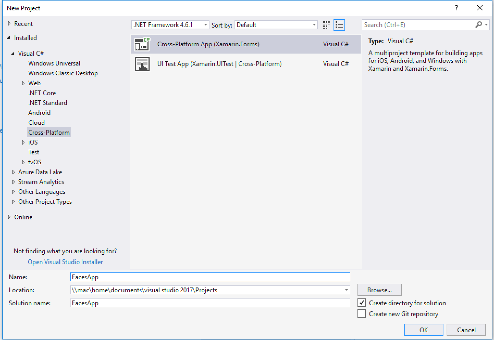


2. Cuando el proyecto se termine de crear instala el siguiente paquete NuGet en todos los proyectos.

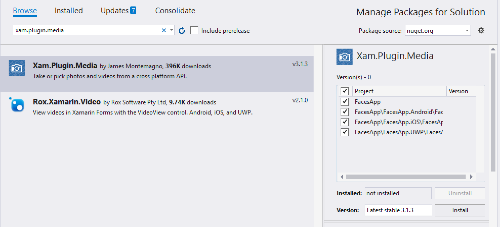

Y sigue las instrucciones del archivo que muestra el archivo que se abre después de instalarse el componente. 

Ahora en el proyecto PCL o Net Standard instala los siguientes paquetes.

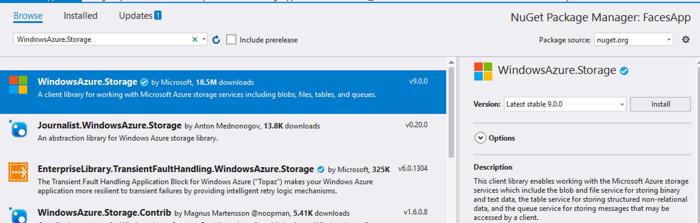
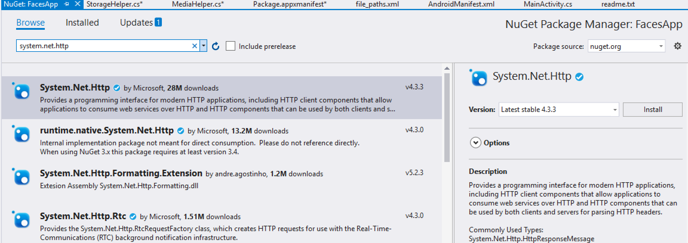
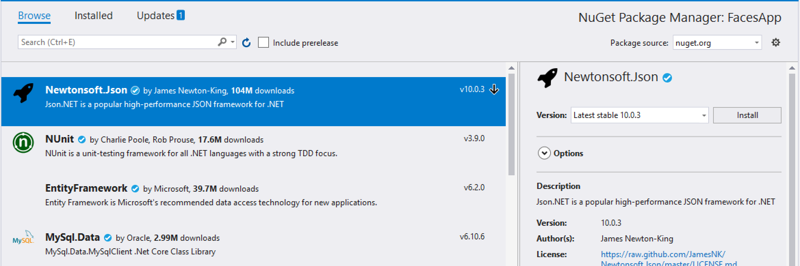

 
3. Crea una clase que se encargue de tomar las fotografías haciendo uso del NuGet de Media.

La clase se llama "MediaHelper" y su contenido es el siguiente.

Using:

```
using Plugin.Media;
using System.Threading.Tasks;
```
Clase

```
public class MediaHelper
    {
        public static async Task<Photo> TakePhotoAsync(string name)
        {
            byte[] photo = null;
            await Plugin.Media.CrossMedia.Current.Initialize();
            if (Plugin.Media.CrossMedia.Current.IsCameraAvailable
               && Plugin.Media.CrossMedia.Current.IsTakePhotoSupported)
            {
                var file = await CrossMedia.Current.TakePhotoAsync(new Plugin.Media.Abstractions.StoreCameraMediaOptions
                {
                    PhotoSize = Plugin.Media.Abstractions.PhotoSize.Full,
                    Directory = "People",
                    Name = name +".jpg",
                    MaxWidthHeight = 512,
                    AllowCropping = true
                });

                if (file != null)
                    using (var photoStream = file.GetStream())
                    {
                        photo = new byte[photoStream.Length];
                        await photoStream.ReadAsync(photo, 0, (int)photoStream.Length);
                    }
            }

            return new Photo() { PhotoData = photo, Name= name + ".jpg" };
        }
    }
```

Como clase de apoyo crea una clase Photo, la cual contiene la fotografía tomada y el nombre del archivo.

```
public class Photo
    {
        public byte[] PhotoData
        {
            get;
            set;
        }

        public string Name
        {
            get;
            set;
        }
    }
```

4. Ahora crearemos una clase que envié la fotografía al contenedor de blobs que generamos en Azure. Esta clase se llama "StorageHelper" y este es su contenido

Using
```
using Microsoft.WindowsAzure.Storage;
using Microsoft.WindowsAzure.Storage.Blob;
using System.IO;
using System.Threading.Tasks;
```

Clase

```
 public class StorageHelper
    {
        

        public static async Task UploadPhoto(Photo photoInfo)
        {
            try
            {
                using (var stream = new MemoryStream())
                {

                    var container = GetContainer();

                    var fileBlob = container.GetBlockBlobReference(photoInfo.Name);

                    await fileBlob.UploadFromByteArrayAsync(photoInfo.PhotoData, 0, photoInfo.PhotoData.Length);

                }
            }
            catch (Exception ex)
            {

                throw;
            }

        }

        private static CloudBlobContainer GetContainer()
        {
            var account = CloudStorageAccount.Parse(Datos de tu storage);

            var client = account.CreateCloudBlobClient();
            var containers = client.ListContainersSegmentedAsync(null).Result;
            return client.GetContainerReference("faces");
        }
    }
```

5. Finalmente tendremos una clase que consuma la función que devuelve la información almacenada.  La clase RestHelper contiene lo siguiente:

Usings
```
using System.Net.Http;
using System.Threading.Tasks;
```
Clase

```
public class RestHelper
    {
        static HttpClient httpClient = new HttpClient();

        public static async Task<List<Person>> GetFaces()
        {
            var response = await httpClient.GetStringAsync("https://tusitio.azurewebsites.net/api/faceinformation");
            List<Person> persons =
            Newtonsoft.Json.JsonConvert.DeserializeObject<List<Person>>(response);
            return persons;
        }

    }
```

Esta ultima clase requiere de otra clase con la información de las personas. Crea una clase "Person" con la siguiente definición

```
public class Person
        {
            public string ImageFile { get; set; }

            public Uri ImageUri { get => new Uri("https://reconnecthjrstorage.blob.core.windows.net/faces/"+ImageFile); }

            public int Age { get; set; }

            public string Gender { get; set; }
        }
```

6. Para  probar lo anterior necesitamos una interfaz de usuario, puede ser algo muy simple como esto (todo dentro de la etiqueta ContentPage en el archivo MainPage.xaml):

```
<StackLayout>
        <Label Text="Nombre de la foto" />
        <Entry x:Name="entImageName" />
        <Button Clicked="BtnTakePhoto_Clicked"  Text="Capturar foto"/>
        <Image x:Name="imgPhoto" HorizontalOptions="Center" HeightRequest="200" WidthRequest="200" Aspect="AspectFill"/>
        <ListView x:Name="lvPersons">
            <ListView.ItemTemplate>
                <DataTemplate>
                    <ViewCell>
                        <StackLayout Orientation="Horizontal">
                            <Image HeightRequest="70" WidthRequest="70" Aspect="AspectFill" Source="{Binding ImageUri}" />
                           
                            <Label Text="{Binding Age}" />
                        </StackLayout>
                    </ViewCell>
                </DataTemplate>
            </ListView.ItemTemplate>
        </ListView>
    </StackLayout>
```

Y el código que hace funcionar esa interfaz es el siguiente (Dentro de MainPage.xaml.cs)

```
private async void BtnTakePhoto_Clicked(object sender, EventArgs e)
        {
       
            string name = entImageName.Text;

            Photo photo = await MediaHelper.TakePhotoAsync(name);
            imgPhoto.Source = ImageSource.FromStream(() => new MemoryStream(photo.PhotoData));
            await StorageHelper.UploadPhoto(photo);
            await Task.Delay(5000);
            lvPersons.ItemsSource = await RestHelper.GetFaces();
        }
```

7. Ejecuta la app en cualquiera de las plataformas y haz la prueba tomando una fotografía y mandándola al contenedor.

